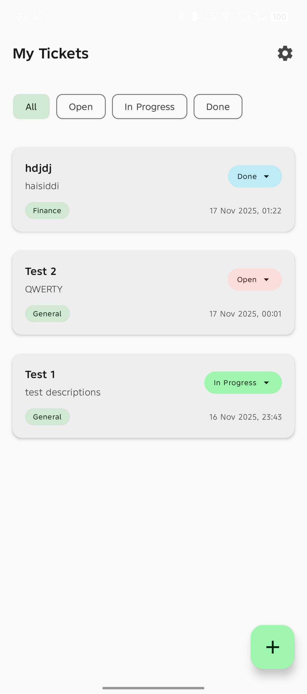
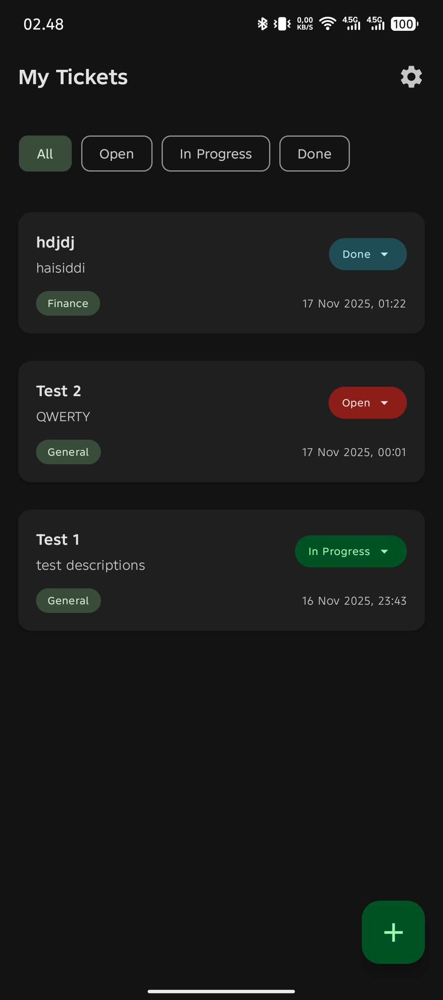
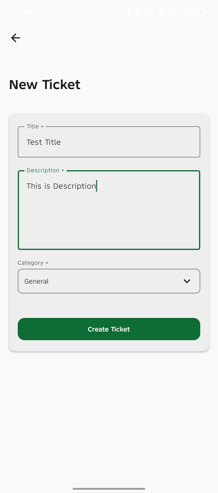
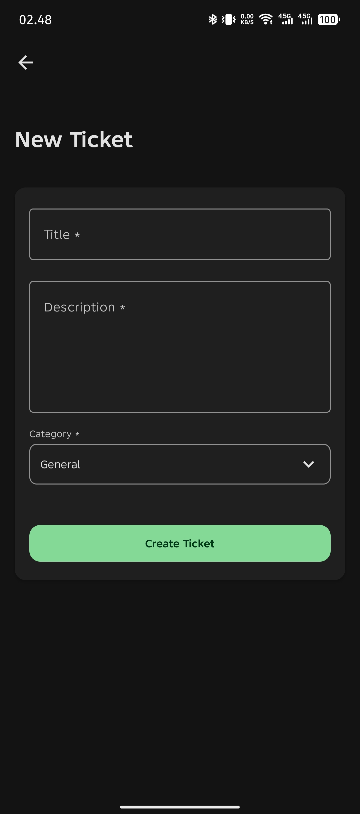
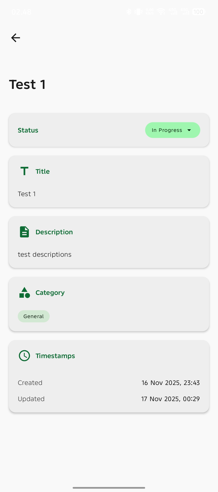
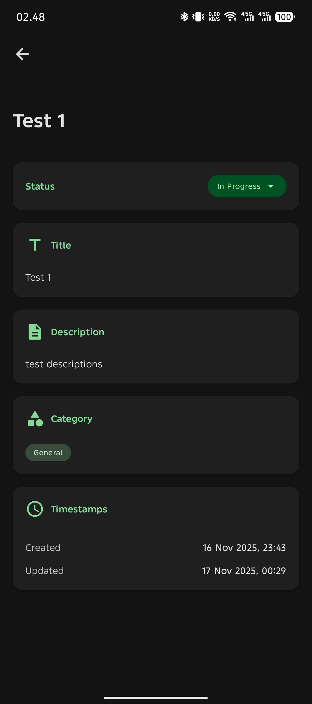

# 📱 MyTicket — Internal Service Request Management App

**PT Dwara Artha Digital - Mobile Dev Test Case**

**MyTicket** is an Android mobile application built to manage internal service requests within a company.  
Users can create tickets, browse and filter lists, update statuses, view detailed information, and customize app preferences — with all data stored **locally** using **Room Database**.

---

## 📸 Screenshots
| HOME LIGHT | HOME DARK | FORM LIGHT | FORM DARK | DETAIL LIGHT | DETAIL DARK |
| ---- | ---- | ---- | ---- | ---- | ---- |
|    |  |    |  |    |  |

## DEMO
| Video |
| --- |
| <video src="https://github.com/user-attachments/assets/e6382bcf-bd44-4dc6-9771-c3c79f808410" controls width="300"></video> |


---

## 🛠 Technologies Used
- **Kotlin**
- **Jetpack Compose**
- **Room Database**
- **Hilt** (Dependency Injection)
- **StateFlow**, **ViewModel**
- **MVVM**, **Clean Architecture**
- **Material 3**
- **Navigation Compose**

---

## 📂 Project Structure
```bash
app/
└─ src/
   └─ main/
      ├─ java/com/azwar/myticket/
      │   ├─ data/local/            # Room entities, DAO, database
      │   ├─ data/repository/       # Repository implementations
      │   ├─ domain/model/          # Domain models
      │   ├─ domain/repository/     # Repository interfaces
      │   ├─ domain/usecase/        # Application use cases
      │   ├─ di/                    # Hilt modules / DI setup
      │   └─ presentation/          # Screens, ViewModels, navigation
      └─ res/                       # Themes, values, icons, etc.
```

---

## 🚀 Project Setup

### 1️⃣ Clone the Repository
```sh
git clone https://github.com/azwarbahar/PT-Dwara-Artha-Digital-Mobile-Dev-Test-Case.git
cd myticket
```
### 2️⃣ Open in Android Studio
- Use Android Studio Giraffe or newer. 
- Go to File → Open and select the project folder.
### 3️⃣ Configure JAVA_HOME (If needed)
Ensure `JAVA_HOME` points to Android Studio’s built-in JDK:
```makefile
C:\Program Files\Android\Android Studio\jbr
```
### 4️⃣ Build the Project
Using IDE:
- Build → Make Project
Or terminal:
```sh
./gradlew assembleDebug
```
### 5️⃣ Run the App
- Connect an Android device or launch an emulator. 
- Press Run (▶️) in Android Studio. 
- Choose the target device and start the app.

### Or you can see how to run it 👉[HERE](BUILD_AND_RUN.md)

---

## ✨ Key Features

### 🏠 Home Screen
- Displays all service tickets.
- Filter options: **All**, **Open**, **In Progress**, **Done**.
- Update ticket status directly via a **Bottom Sheet**.
- **Floating Action Button (FAB)** to create new tickets.

### 📝 New Ticket Form
- Input validation for title, description, and category.
- Category options: IT Support, HR, Facilities, Finance, General.
- Default ticket status: **OPEN**.

### 📄 Ticket Detail
- Attractive and clean UI displaying complete ticket information.

### ⚙️ Settings Screen
- App information.
- Dummy user profile.
- Light/Dark mode toggle.

### 🗄 Offline Local Storage (Room)
- Works completely offline — no internet required.
- Full support (Create, Read, Update).

### 🎨 Modern UI/UX
- Built with **Jetpack Compose**.
- Uses **Material 3** for a modern, clean interface.
- Smooth navigation using **Navigation Compose**.
